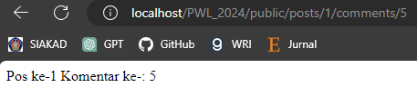
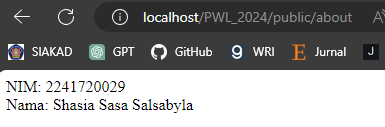

# Jobhseet 2 - Routing, Controller, dan View

Nama : Shasia Sasa Salsabyla \
Kelas : TI - 2F \
No.Absen/NIM : 25/2241720029

## Basic Routing

1.  Route Hello \
     \
     Halaman muncul tulisan Hello Word, sesuai dengan apa yang diketikkan di file web.php

          Route::get('/hello', function () { return 'Hello World'; });

2.  Route World \
     \
    Halaman menampilkan tulisan World sesuai dengan

          Route::get('/world', function () { return 'World'; });

3.  Route Index\
    

4.  Route About \
    

## Route Parameters

1. Route User \
    \
   Halaman menampilkan "Nama saya Shasia" dengan mengetikkan URL localhost/PWL_2024/public/user/Shasia. "Shasia" ditampilkan dari apa yang diketikkan di URL.

2. Route User (Not Found) \
    \
   Sama seperti sebelumnya, tapi karena URL tidak dilengkapi nama sehingga tidak menemukan halaman yang dicari dan menampilkan halaman 404 Not Found.

3. Route Comments \
    \
   Sama seperti sebelumnya. Namun disini route bisa menerima lebih dari 1 parameter. Route menerima parameter $postId dan juga $comment.

4. Route Articles \
   

## Optional Parameters

1. User (Null) \
    \
   Karena disini diberi keterangan nama = null, sehingga jika pada URL tidak diberi "nama" maka hanya menampilkan "Nama saya" tanpa ada yang dipanggil.

2. User/Shasia \
    \
   Sama seperti sebelumnya, namun disini diketikkan "nama" pada URL

3. User \
    \
   Menampilkan "Nama saya John" karena sudah ditentukan pada kode programnya.

## Controller

1. Membuat Controller \
   

2. Controller Hello \
    \
   Menampilkan halaman web dengan tulisan "Hello World". Disini menggunakan controller agar lebih terstruktur.

3. Modifikasi \
    \
    \
    \
    \
   

4. Modifikasi Single Action Controller

     \
     \
     \
     \
     \
     \
     \
    

## Resource Controller

1. Membuat Controller \
   

2. List Route \
   

## View

1. View \
    \
   Menampilkan "Hello, Shasia" dengan menggunakan view, dengan route memanggil view sesuai dengan nama file.

2. View dalam Direktori \
    \
   Disini menyimpan file view dalam direktori blog. Menampilkan halaman yang sama seperti sebelumnya.

3. View dari Controller \
    \
   Menggunakan controller untuk memanggil view. Routing akan memanggil controller terlebih dahulu, kemudian akan me-return view yang dituju.

4. Meneruskan Data ke View \
    \
   Meneruskan data array ke view agar data tersebut tersedia untuk view. Tampilan sama seperti sebelumnya dengan tambahan array.
