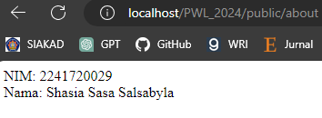
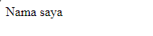
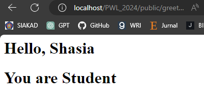

# Jobhseet 2 - Routing, Controller, dan View

Nama : Shasia Sasa Salsabyla \
Kelas : TI - 2F \
No.Absen/NIM : 25/2241720029

## Basic Routing

1. Route Hello \
   

2. Route World \
   

3. Route Index\
   

4. Route About \
   

## Route Parameters

1. Route User \
   

2. Route User (Not Found) \
   

3. Route Comments \
   

4. Route Articles \
   

## Optional Parameters

1. User (Null) \
   

2. User/Shasia \
   

3. User \
   

## Controller

1. Membuar Controller \
   

2. Controller Hello \
   

3. Modifikasi \
   
   
   
   
   

4. Modifikasi Single Action Controller \

    
    
    
    
    
    
    
    

## Resource Controller

1. Membuat Controller \
   

2. List Route \
   

## View

1. View \
   

2. View dalam Direktori \
   

3. View dari Controller \
   

4. Meneruskan Data ke View \
   
